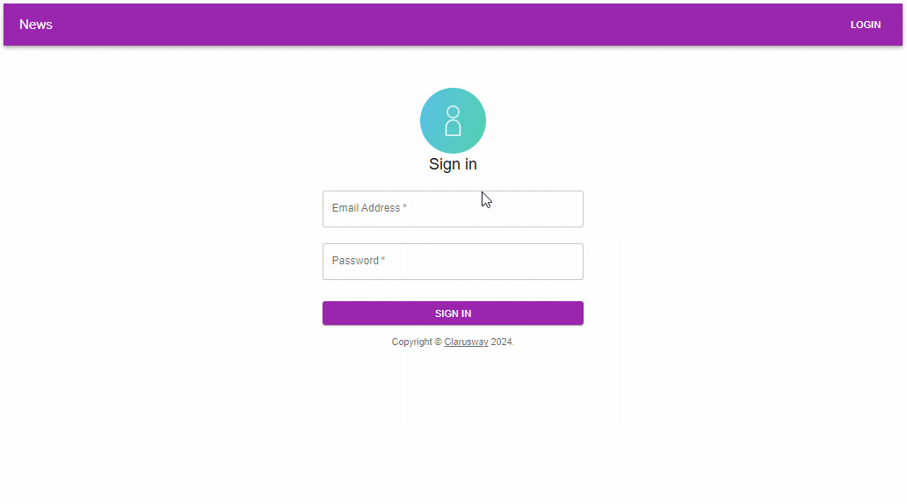

# Hi I'm Nurdoğan Bahadır 👋. Welcome to my Redux Toolkit Project with React.

This project was developed with React. Redux Toolkit and Mateial UI were also used in the application. In the project, the user who logs in from the login page can see the news. Logout button is added for the user to log out.

# Live Link of the Project

[Click Me](https://redux-toolkit-nurdoganbahadir.netlify.app/login)

# Libraries and Technologies I use

- Material UI
- Redux Toolkit
- Axios
- react router dom
  

# How to install

In the project directory, open the terminal and run:

### `npm install`

This will install the necessary dependencies. After that, you can run:

### `npm start`

# How does my project look

